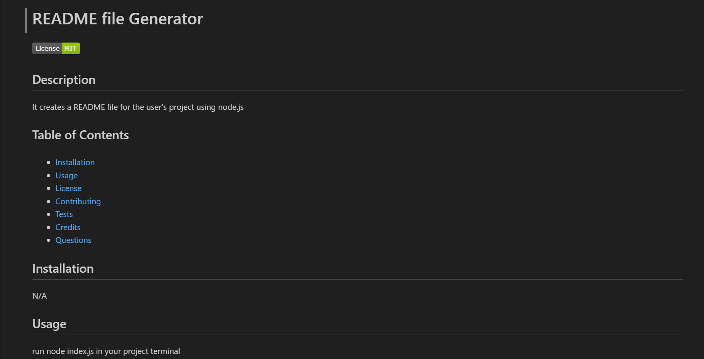

# README file Generator
  
  ## Description

  This application uses Node.js to create a README file by gathering user input and generating content based on a set of project-related questions

  ## Installation

  N/A

  ## Usage
  * Open terminal in the same folder to where the index.js file is located and run "node index.js" into the terminal. 
  * You will need to answer the questions provided in the terminal about your project so that your inputs will be taken to generate the README file.
  * Once the question are all answered a success! message will appear and your README file will be generated in that same folder.

  

  ## Credits

  N/A

  ## License

  Please refer to the LICENSE in the repo.

  
